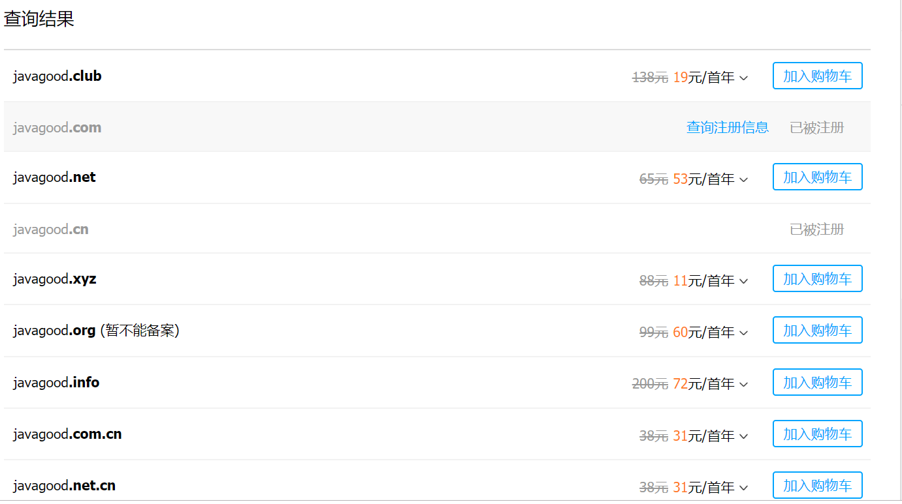
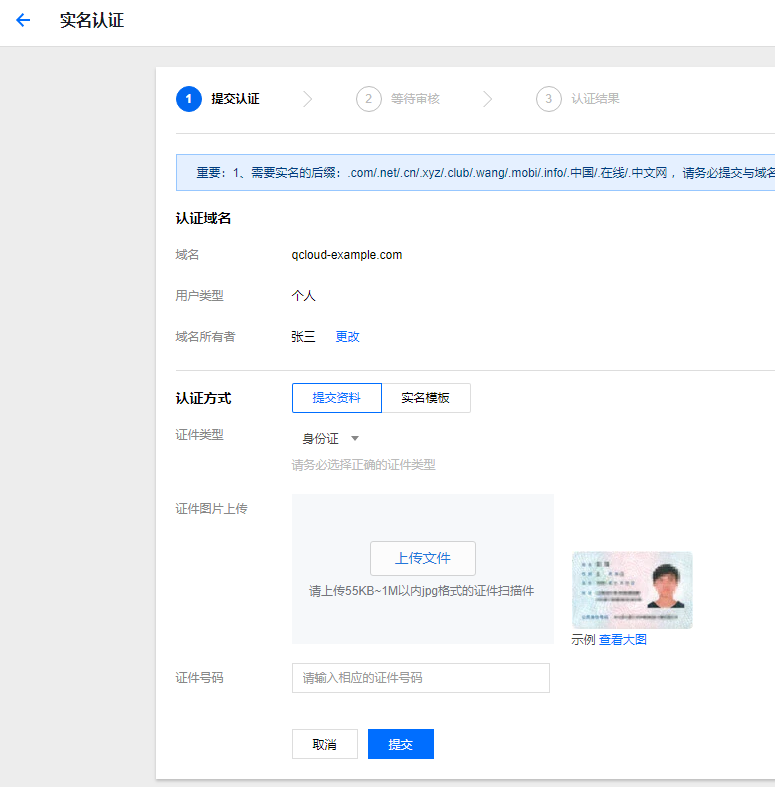
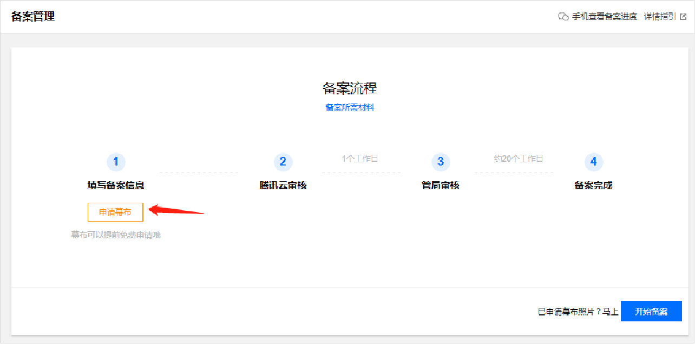
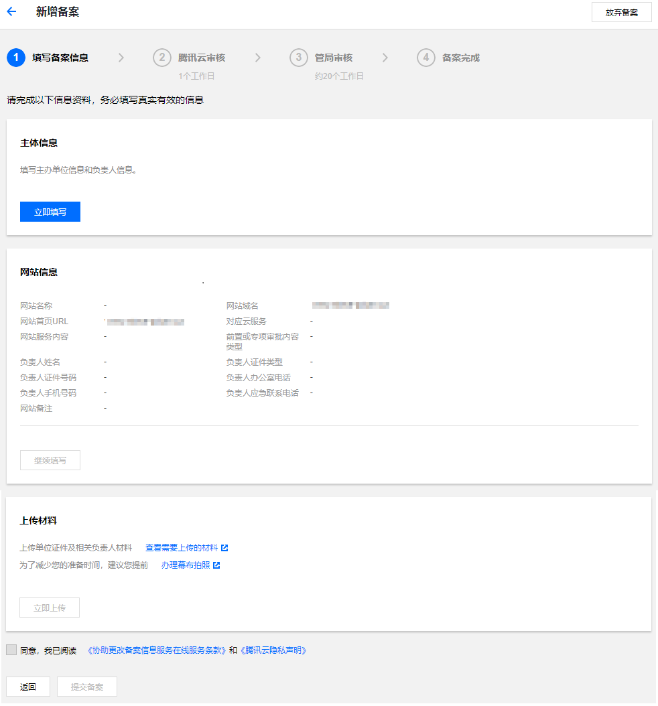
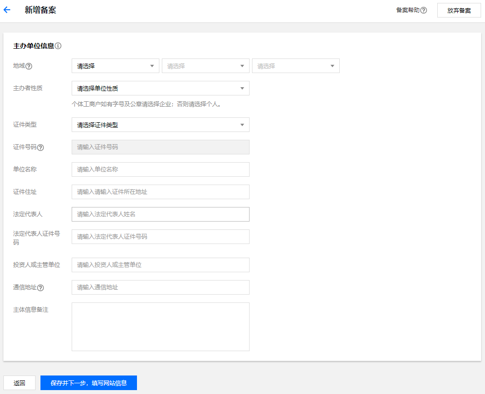
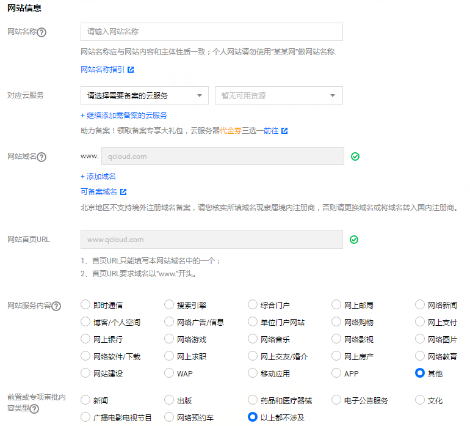
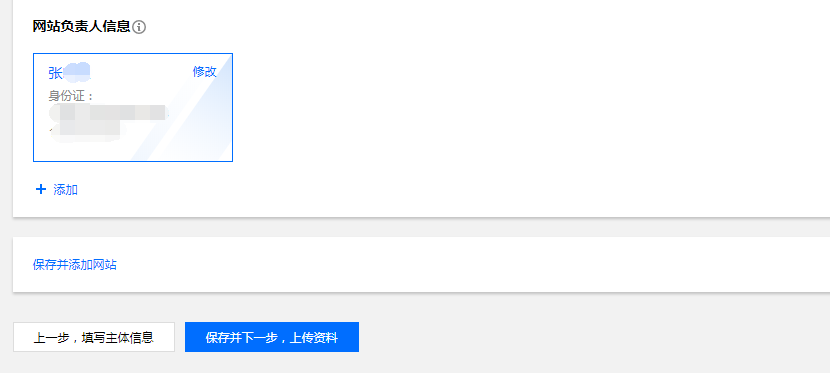

# 域名注册（以腾讯云为例）

**注意：本教程以腾讯云为例，其他域名注册商请依据实际情况进行操作**

## 腾讯云账号注册及实名认证

1.进入腾讯云账号[注册页面](https://cloud.tencent.com/register?)，依据实际情况，选择`微信`或者`QQ`完成腾讯云账号注册

2.个人实名认证方式有以下三种:

### 微信认证

1.登录腾讯云控制台，进入[账号信息](https://console.cloud.tencent.com/developer)。

2.进入账号信息页面，选择`基本信息`>`认证状态`，单击`提交认证`。

3.选择个人认证，单击`开始认证`。

4.填写个人姓名、身份证号等信息。

5.选择微信认证方式，使用绑定了您的银行卡的微信客户端，扫码支付0.01元。0.01元会存入您的腾讯云账户，您可以在[费用中心](https://console.cloud.tencent.com/expense/overview)进行提现。  

6.支付成功后，立即完成实名认证。  

### QQ认证  

1.登录腾讯云控制台，进入[账号信息](https://console.cloud.tencent.com/developer)。

2.进入账号信息页面，选择`基本信息`>`认证状态`，单击`提交认证`。

3.选择个人认证，单击`开始认证`。

4.填写个人姓名、身份证号等信息。

5.选择 QQ 认证方式，请使用绑定了您的银行卡的手机 QQ 扫描二维码。

6.完成实名认证。

**说明：如果您的 QQ 号未完成银行卡认证，手机 QQ 扫码后，将跳转至引导绑定银行卡的 H5 页面，单击【立即绑定银行卡】，根据页面提示完成银行卡绑定。**

### 人脸识别认证

1.登录腾讯云控制台，进入[账号信息](https://console.cloud.tencent.com/developer)。

2.进入账号信息页面，选择`基本信息`>`认证状态`，单击`提交认证`。

3.选择个人认证，单击`开始认证`。

4.填写个人姓名、身份证号等信息。

5.选择人脸识别方式，微信扫描二维码，单击`快速验证`。

6.勾选同意服务协议后，单击`下一步`，即将开始人脸识别。

7.人脸识别验证通过后，即可自动完成实名认证。

## 域名注册及购买

### 查询域名

1.进入腾讯云[域名注册](https://dnspod.cloud.tencent.com/)，在域名注册页面，输入您想要的域名和后缀，单击`查询`，即可查看该域名的注册情况如下图所示(这里以`javagood`为例)。

2.选择合适的域名，加入购物车-->立即购买

### 填写域名信息

1.在 “提交订单” 页面，确认域名的购买时长，填写您的域名信息，并勾选 “我已阅读并同意《腾讯云域名注册协议》和《腾讯云隐私声明》”。

2.填写用户信息。

如果您之前购买过域名，选择使用之前填写的域名信息即可。

如果您使用新的域名信息，选择`使用新的域名信息`，并填写您新的域名信息，单击`保存`即可。

### 核对信息并完成支付

1.在 “核对信息” 页面，核对您的域名信息、购买时长以及费用，确保信息准确无误。

2.单击`确认购买`，进入支付页面。

3.依据实际情况完成支付。

## 域名实名认证

1.登录[腾讯云控制台](https://console.cloud.tencent.com/)。

2.选择 “云产品 > 域名与网站 > 域名管理”，进入 `域名管理` 页面。

3.在左侧导航栏中，选择 “我的域名 > 未实名认证”，查看您未实名认证的所有域名信息列表。

### 提交认证资料

1.在需要实名认证域名行中，单击`未实名认证`，进入 “实名认证” 页面。如下图所示：

2.核对认证域名的信息是否有误。如需修改认证域名的信息，单击`更改`。

3.根据实际需求，选择 `认证方式`。

- 选择 `提交资料` 方式

   - 证件类型：选择需要提交认证证件的类型，包括身份证、港澳居民来往内地通行证、中国台湾居民来往大陆通行证和外国人永久居留身份证。
   
   - 证件图片上传：请根据选择的证件类型，上传证件扫描件。
   
   - 中国大陆地区居民：请上传有效的域名所有者个人身份证正面（即有头像和身份证号码的一面）扫描件或高清照片。如果您没有身份证，中国大陆地区居民可以选择以下其中一种材料扫描件进行提交。
   
   - 与域名所有者姓名一致的户口簿原件扫描件。
   
   - 加盖公安局户口专用章的户籍证明扫描件。
   
   - 临时身份证正面扫描件。
   
   - 非中国大陆地区居民或者无居民身份证的居民：提交护照或港澳居民来往内地通行证，并确保所填写所有者名称与资料上的名称一致。
   
   - 证件号码：核对系统自动补充的证件号码。
   
-选择 “实名模板” 方式

   -选择已实名的模板。
   
   -核对选择实名模板的信息是否有误。
   
4.提交

### 等待审核结果

提交资料后，需要等待**3 - 5个工作日**。审核通过会有邮件通知您。

## 域名备案

### 备案准备

1.查看各省[备案要求](https://cloud.tencent.com/document/product/243/3474)

2.通过腾讯云备案，需要先购买腾讯云中国大陆地区有公网 IP 的服务器，计费模式需为包年包月，购买时长需超过`3个月`。

### 备案流程

#### 办理幕布拍照

登录[腾讯云网站备案控制台](https://console.cloud.tencent.com/beian)。

单击`申请幕布`，根据您的实际需要，选择邮寄幕布自行拍照或前往拍照点进行拍照。如下图所示：

#### 验证备案信息

##### 验证备案云服务

1.登录[腾讯云网站备案控制台](https://console.cloud.tencent.com/beian)。

2.单击`开始备案`，系统将自动验证您当前账号下是否有满足条件的备案云服务资源。

如有，进入域名验证环节。

如无，请根据系统提示购买云服务器或者单击`使用授权码备案`。

##### 验证备案域名

1.请确认您需要备案的域名，并单击`立即检测`。

2.在域名检测结果页面，如果域名可进行备案，则单击`立即备案`。

#### 填写主体信息

1.单击`立即填写`，填写主体信息,如下图所示。

2.请按照页面提示，填写您需要备案的主体信息。如下图所示：

**注意：
1.请按真实情况填写信息。
2.个人备案时，无需重复填写主体负责人信息。
3.如果您需要备案的域名已实名认证，实名认证信息将显示在主体信息中。具体请参考[实名认证](https://cloud.tencent.com/document/product/242/6707)。**

**主办单位信息填写：**

**备案地域**：请与所提供的单位证件上的证件住址保持一致。

**单位名称**：请填写与所提供证件完全一致的单位名称。

**证件住址**：请填写与所提供证件完全一致的证件住址。

**投资人或主管单位**：请填写企业真实投资人或真实主管单位。

**通信地址**：请根据实际情况填写真实准确的地址。单位备案可填写单位办公地址，通信地址需要精确到门牌号。

**主体信息备注（选填）**：请根据页面提示进行备注。

**主体负责人信息填写：**

**证件类型**：请根据实际情况选择证件类型。

**证件号码**：根据选择的证件类型，填写证件上所对应的证件号码。

**联系方式**：需真实有效且能联系到备案负责人。在备案期间审核人员可能会拨打负责人手机核实信息，请保持电话畅通以便顺利核实信息。

**电子邮箱**：可正常接收邮件的有效邮箱。

3.单击`保存并下一步，填写网站信息`，进入网站信息填写流程。

#### 填写网站信息

1.请按照页面提示，填写网站信息。 如下图所示：

**网站名称**：请填写您的网站名称。可参考 网站名称命名要求 。

**对应云服务**：请选择您用于备案的云服务，如云服务器、备案授权码等。

**网站域名**：由系统根据您在验证备案类型时填写的信息自动进行填充，无需手动填写。

**网站首页 URL**：由系统根据您在验证备案类型时填写的信息自动进行填充，无需手动填写。

**网站服务内容**：请按实际情况选择网站服务内容，若选择 “其他”，则必须在网站备注中填写开办后的具体内容。

**前置或专项审批内容类型**：若网站内容中涉及出版、新闻等相关领域，需到相关主管部门办理前置审批文件；否则选择“以上都不涉及”。

2.请按照页面提示，填写网站负责人信息。 如下图所示：

若网站负责人与主体负责人`相同`，可直接勾选`同主体负责人`选项。

若网站负责人与主体负责人`不同`，单击【+添加】，按真实情况填写网站负责人信息。

**证件类型**：请根据实际情况选择证件类型。

**证件号码**：根据选择的证件类型，填写证件上所对应的证件号码。

**联系方式**：需真实有效且能联系到备案负责人。在备案期间审核人员可能会拨打负责人手机核实信息，请保持电话畅通以便顺利核实信息。

**电子邮箱**：可正常接收邮件的有效邮箱。

**网站备注（选填）**：请根据页面提示进行备注。

3.单击`保存并下一步，上传材料`，进入材料上传流程。

#### 上传材料

请根据页面提示上传材料。如下图所示：

#### 确认备案信息，提交初审

在备案信息总览页面，确认信息准确，阅读并勾选 “同意，我已阅读《协助更改备案信息服务在线服务条款》和《腾讯云隐私声明》”。单击`提交备案`，提交腾讯云初审。

**注意:** 审核专员会在`1个工作日内`进行审核并电话联系您沟通确认订单问题，请确保您填写的联系方式真实且可接通。若审核专员首次拨打电话未联系到您，会在`一个小时左右`再次与您联系。若仍未能与您取得联系，您的备案申请将被驳回。
#### 通过审核，完成备案
腾讯云审核通过后，腾讯云将提交您的备案信息至当地管局进行最终审核。管局审核结果，腾讯云会以短信和邮件的形式通知您。
您可以通过登录[腾讯云备案控制台](https://console.cloud.tencent.com/beian)，查看已备案的主体信息和备案网站信息。
